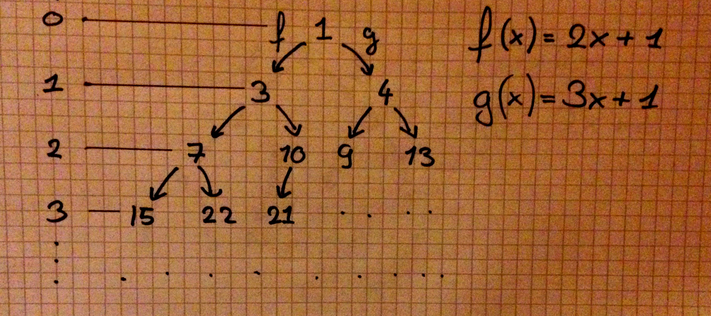
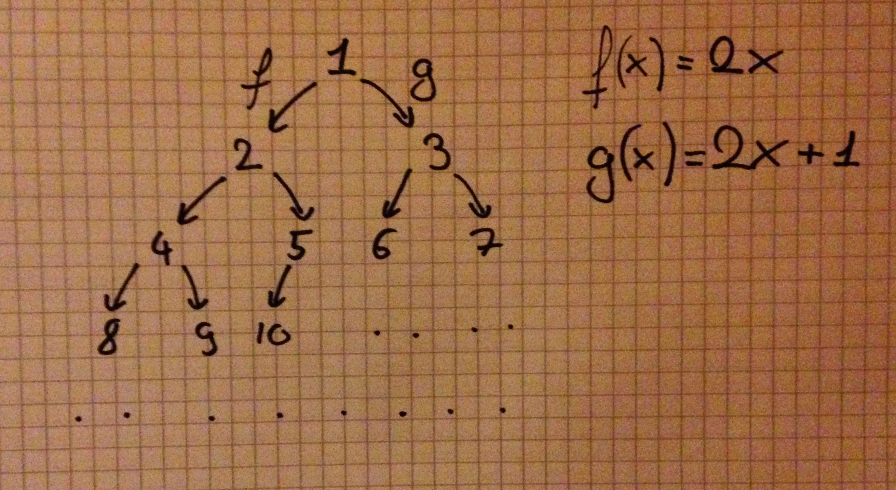
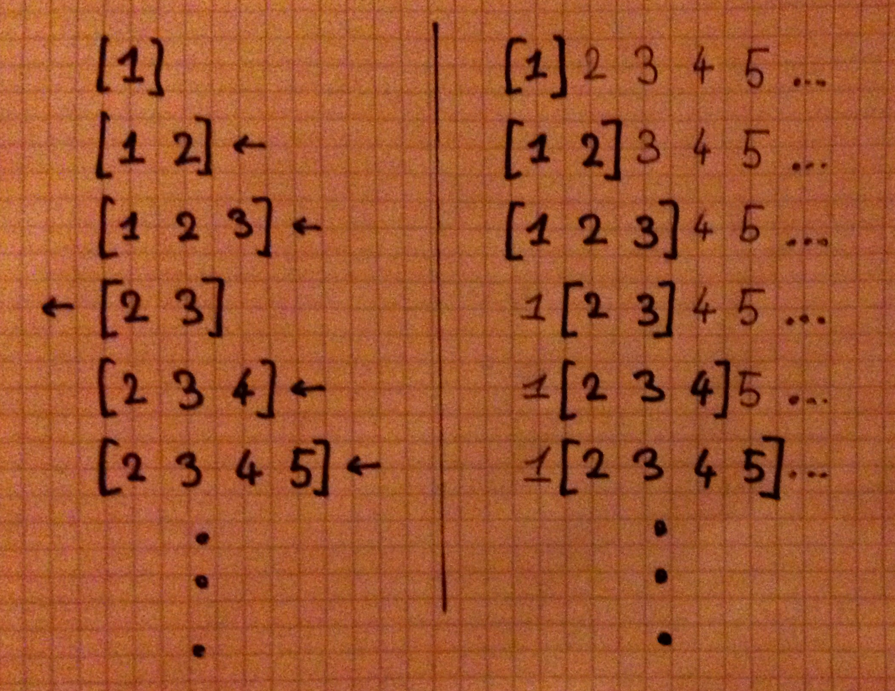

In order to warm up for a round of interviews next week, I've been
playing around with coding puzzles. Those are usually solved using
imperative languages, and I thought I'd have a go at them using Haskell.
I'll share today's experience, which hopefully will convince you that
purely functional languages are (sometimes) suitable for puzzles.

<!--more-->

## Disclaimer

_There is probably nothing new here. Also, there might be better
solutions to solve the problem. I like this solution because it gave me
an excuse to showcase Haskell's laziness. Feel free to ping me if you
come up with something better._

## The puzzle

Let's start with the problem itself. You are given a number, $x_0$, and
a target, $x_f$. You are allowed two functions: $f(x) = 2 x + 1$ and
$g(x) = 3 x + 1 \; .$

Give either the minimal number of applications of $f$ and $g$ that you
need in order to reach $x_f$ from $x_0$, or state that one cannot reach
$x_f$ from $x_0$.

For instance:

- in order to reach $x_f = 4$ from $x_0= 1$, you need one application:

  $x_f = 4 = 3 \cdot 1 + 1 = g(1) = g(x_0)$

- in order to reach $x_f = 10$ from $x_0= 1$, you need two
  applications:

  $x_f = 10 = 3 \cdot 3 + 1 = g(3) = g(2 \cdot 1 + 1) = g \circ f (1) = g \circ f (x_0)$

- you cannot reach $x_f = 8$ from $x_0 = 1$.

I like to think of the values as a tree where each node has degree $2$.
To get to a left child, apply $f$. To get to a right child, apply $g$.
In this case the answer is equal to the depth of $x_f$, where the root
is $x_0$. Now you just need to traverse the tree, starting from the
root, until you find $x_f$. Using the following observation:

- $4 \cdot x \gt 3 \cdot x + 1, \forall x \gt 1$

we know that we can safely stop whenever we hit a node with depth:

$d \gt 4 \cdot x$.



Clearly the number of nodes traversed (assuming a BFS) is proportional
to the exponential of the depth (it is actually $2^d$). But we also know
that there is at least a factor $2$ between each "layer"
($\forall x \gt 0, f(x) \gt 2x$). So we can conclude that
$x_f - x_0 > 2 ^ d$ and so our algorithm should run in $O(x_f - x_0)$.
Now let's write some code.

## The code

```haskell
import System.Environment (getArgs)
```

First we need to define a suitable tree structure. We define a binary
tree in which each node holds some data. The data we will record is the
node's depth (or distance from the root) and a value:

```haskell
data Tree = T { depth  :: !Int
              , value  :: !Int
              , l      :: Tree
              , r      :: Tree }
```

We keep the links to the children lazy so that we can build an infinite
tree. Whenever we create a node it is very likely that we will need the
data it contains, so we keep the data strict. This is a typical lazy
spine/strict leaves structure, and has the added bonus of easily
allowing GHC to unpack the `Int`s.

Now, let's build that tree:

```haskell
mkTree :: Int -> Tree
mkTree = go 0
  where
    go d v = T { depth = d
               , value = v
               , l     = go (d + 1) (2 * v + 1)
               , r     = go (d + 1) (3 * v + 1) }
```

Note that we don't have to limit ourselves to the functions $f$ and $g$.
Here's, for instance, a complete binary tree:

```haskell
-- As an example
completeBinaryTree :: Tree
completeBinaryTree = go 0 1
  where
    go d v = T { depth = d
               , value = v
               , l     = go (d + 1) (2 * v )
               , r     = go (d + 1) (2 * v + 1) }
```

This second tree would look like this:



Now comes the fun part, the breadth-first search (note that you
typically don't want to do a depth-first on an infinite tree). A typical
implementation of a BFS uses a queue. It would go something like this:

- Dequeue a node from the queue and append it to an output list.
- Enqueue all this node's children.
- Repeat until your queue is empty.

This is a simplified version that will work just fine for a tree (we
don't need to check whether or not we have already visited the current
node). If you know your functional data structures, you'll recognize a
typical queue:

```haskell
data Queue a = Queue { front :: [a]
                     , back  :: [a] }
```

Whenever you want to enqueue a value, you cons it on `back`. Whenever
you want to dequeue a value, you uncons it from front. And whenever
front is empty you replace it with back (in reverse order). This gives
you worst-case `O(1)` for enqueue and dequeue operations, and `O(n)` for
tail (that's where you'll reverse the back, see Okasaki's [Purely
Functional Data
Structures](https://www.cs.cmu.edu/~rwh/theses/okasaki.pdf) for a good
overview).

## The search

Easy enough. Now we just need a `State Queue` monad, traverse the tree,
and update our queue every time, discarding the old one. Also, we'll
need a `Writer [Tree]` to output the nodes. Right? Well, in our case we
can do much simpler. We will simply use a list and take advantage of the
language's laziness. We'll take a list of nodes and return a list of
their children. It will extract the left and right children of a node,
then move to the next node, repeat the process and concat the result.

```haskell
children = concatMap (\t -> [l t, r t]) nodes
```

All good. Now we just need to bootstrap it:

```haskell
bfs :: Tree -> [Tree]
bfs root =
  let
    nodes = root : children
    children = concatMap (\t -> [l t, r t]) nodes
  in nodes
```

Let's check it out on our binary tree in `ghci`:

```haskell
λ: value <$> take 10 (bfs completeBinaryTree)
[1,2,3,4,5,6,7,8,9,10]
```

Sweet! When `concatMap` is called the first time, it'll split the root
into its left and right children. This means that the root's left child
is now the second element in `nodes`. When `concatMap` has to work
again, it'll spit out first the left child's own children, then the
right child's own children, etc, concating the children lists every
time. Looks like we have a breadth-first search using a list instead of
a queue! And added bonus, we got rid of `Queue`'s `O(n)` worst case,
since we never even `tail`!



In this case, a queue is nothing more than a window, or slice, of a
list. Every time we enqueue, we expand the window to the right. Every
time we dequeue, we shrink the window on the left. This is unfortunately
not an all purpose queue. Once the first cell of the list is created,
all the remaining ones must be determined already.

The only thing left to do is to traverse the nodes produced by `bfs`
until we hit either $x_f$ or a number that we know is too large:

```haskell
distance :: Int -> Int -> Maybe Int
distance x0 xf = go nodes
  where
    nodes = bfs $ mkTree x0
    go (t:ts) | value t == xf     = Just $ depth t
              | value t > 4 * xf  = Nothing -- from analysis
              | otherwise         = go ts
```

_Et voilà!_ We can go a bit fancy and add a cli (that will happily crash
on you on bad input):

```haskell
main :: IO ()
main = do
  [x0, xf] <- (read <$>) <$> getArgs
  print $ distance x0 xf
```

Compiled with

    $ ghc --make -O2 -funbox-strict-fields bfs-tree.lhs

the program runs to up to 10,000,000,000 under two seconds, which is not
too bad. (Dell XPS 13, 2015)

    $ time posts/2016-07-31-bfs-tree 1 3000000000
    Nothing
    posts/2016-07-31-bfs-tree 1 3000000000  0.57s user 0.13s system 99% cpu 0.708 total

    $time posts/2016-07-31-bfs-tree 1 6000000000
    Nothing
    posts/2016-07-31-bfs-tree 1 6000000000  1.04s user 0.19s system 99% cpu 1.230 total

    $ time posts/2016-07-31-bfs-tree 1 10000000000
    Nothing
    posts/2016-07-31-bfs-tree 1 10000000000  1.49s user 0.62s system 99% cpu 2.111 total

To get it to run on larger inputs, I suspect one would need to find a
better algorithm. It would maybe even allow replacing `Int`s with
`Integer`s. Once again, if you do find something, please get in touch :
)
