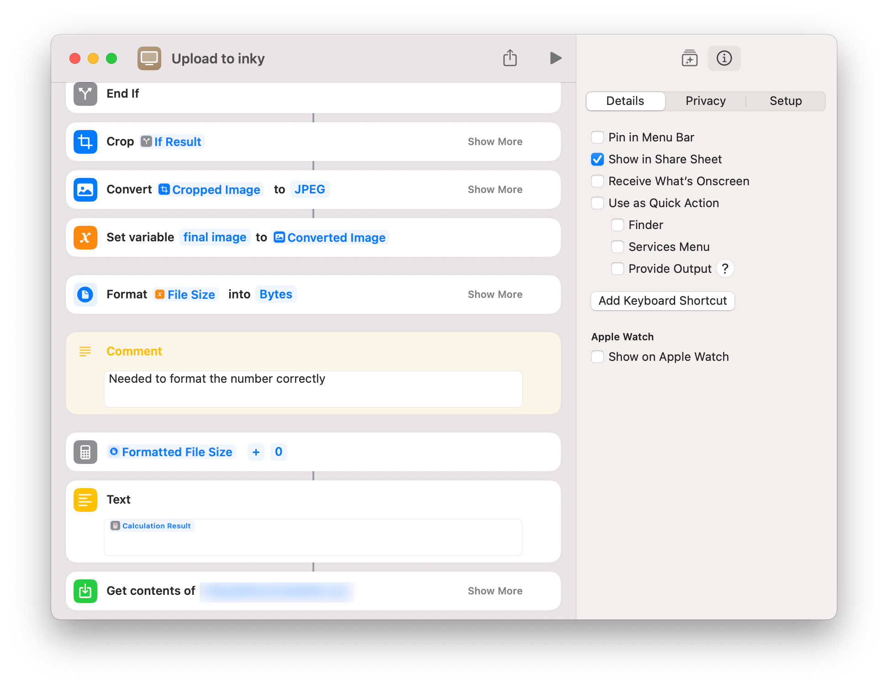

This is a brain dump of the process of writing uht, an HTTP/1.0-compliant (mostly) server that runs on MicroPython.

{/* more */}

A couple months ago I bought the gorgeous 7.3" Inky Frame from pimoroni. It's a huge 7-color e-ink display with a Raspberry Pi Pico 2W soldered on the back. My goal was to set it up on a wall in the kitchen so that my partner and I could leave each other notes, instead of the post-its we're currently using.

My partner not being very tech-savvy I wanted to reduce the friction as much as possible and decided on using an Apple shortcut (link). The Apple shortcuts are basically WYSIWYG scripts that can be called natively from any (recent) Apple device like an iPhone.



What's very nice is that they also appear in the list of actions in the "Share sheet" (the dialog that shows up when you click the share button).

Since Shortcuts can make HTTP requests, the only thing required from the Inky is to be able to handle an HTTP file upload. With this, you can potentially take a picture and, with two clicks and assuming the Inky is online, upload it.

I made a quick proof of concept and really liked the ergonomics of it:

import BlueSkyInky from "./BlueSkyInky.astro";

<BlueSkyInky />

## Getting started with MicroPython

I had done some C & Rust development for the Pi Pico (link to ghostwriter) but had never used MicroPython. I had never really used Python for that matter, and whenever I did, tried to avoid dependencies and fit everything into a single file. This was an introduction to the Python — and MicroPython — ecosystem(s).

MicroPython is a Python interpreter written in C. It tries to be as compatible as possible with CPython (the reference Python implementation, i.e. the one you run when calling `python` or `python3`). In particular, aims to be compatible with "Python 3.4" (with some features backported).

You start by flashing the MicroPython interpreter to your microcontroller. In the case of the Pi Pico it means entering bootloader mode; the device then shows up as a removable media and you can drag-and-drop the MicroPython UF2 file (link to mp downloads) onto it. In the case of the Inky Frame, "some" MicroPython version already comes pre-installed, and the demo apps are actually written in (Micro) Python.

(Add picture of the demo apps)

The first unknown for me was to figure out how to actually upload Python code to the board. Most Pimoroni docs mentions using "Thonny" which is an IDE. I don't like IDes and prefer to work from the terminal whenever possible; this makes my setup portable, avoids magic (everything is explicit and I can understand what happens and learn from it) and allows me to use the same commands both locally and on CI (well, and allows me to use commands _at all_).

It turns out MicroPython has a handy tool call `mpremote` that can connect to a board running MicroPython over (USB) serial. This means that if your board running MicroPython is connected via USB, you can open a MicroPython REPL in one command:

```
<micropython REPL snippet>
```

> [!NOTE]
>
> notes about MP file system

The `mpremote` protocol supports a wide range of commands, including `mpremote edit` which allows editing files in place. This means you can get super fast feedback cycles for testing out changes. After studying the docs a bit more I learned that when MicroPython boots, it starts by evaluating the file `/boot.py` — if it exists — and then runs `main.py`. The `main.py` does not need to return, i.e. it can be a long-running "process".

```
<mpremote edit `main.py` screenshot with nvim>
```

The first step was to print a simple "hello, world" over serial USB. What wasn't clear to me at first is that `mpremote` only allows a single connection at a time, so you can't for instance have a REPL opened in one terminal and run `mpremote` commands like `edit` in another terminal. This (and the various `Ctrl+<key>` REPL combos) took some getting used to, but eventually I was able to edit the original `main.py` from the stock pimoroni firmware and replace it with a print statement. First `mpremote edit /main.py` copies the file from the board to a tempfile on my dev machine, then opens [`$EDITOR`](https://neovim.io/). When the editor closes, the file is copied back to the board and MicroPython resets ("reboots"). As the reset is very fast, the print statement will most likely run before we've opened a REPL and we'll miss it. Using `Ctrl+D` we can perform a reset from within the REPL:

> [!NOTE]
>
> insert gif of adding a `print()`

I've been writing code for a while now but getting a print from a new framework/language/device always gives me such a high!

## Connecting the Inky Frame to WiFi

Now that I had a basic grip on `mpremote` and knew I could execute a print statement on the board it was time to figure out how to connect the board to my WiFi network.

Pimoroni provides a MicroPython environment for the Inky Frame that includes all the necessary libraries for driving the display and more. Among others it supports connecting to a wireless network out of the box.

The [Getting Started](https://learn.pimoroni.com/article/getting-started-with-inky-frame) guide on the Pimoroni website instructs the user to edit a file called `secrets.py` from Thonny. I surmised that this was somehow `import`ed by the main application, and with my newfound `mpremote` knowledge I was able to not only confirm the theory (`mpremote cat :/main.py`) but also set my WiFi credentials (`mpremote edit :/secrets.py`) (the `:` before the filename means you want to edit files on the board, not e.g. `/main.py` on your host/dev machine, this distinction comes in handy in a couple commands).

The preloaded firmware (which I reverted to after my `print()` experiment) includes a couple of examples that fetch data from the Web and I was able to confirm that my device was successfully able to access my wireless network:

> [!NOTE]
>
> Add picture of inky running the BBC news feed or something. Mention that it's a reenactment.

## Handling HTTP requests with MicroPython

With the device connected to the network things were looking pretty good and I started reading the MicroPython docs to figure out how I could handle HTTP requests. It originally didn't cross my mind to check if there were micropython libraries for doin this; I though MicroPython was a niche project and assumed no one would have bothered.

Bit of docs reading and a couple of attempts later I was able to accept incoming TCP connections:

```python
s = socket.socket()
sockaddr = socket.getaddrinfo("0.0.0.0", 80)[0][-1]

# set address reuse in case the stack is still set up
s.setsockopt(socket.SOL_SOCKET, socket.SO_REUSEADDR, 1)
s.bind(sockaddr)

s.listen()

conn, addr = s.accept()
```

From there on, I wrote the absolute most simple HTTP server that would fit my needs:

```python
# request line; we simply assume it's well formed and accept anything
_req_line = conn.readline()

# read all headers, though we only care about content_length
content_length = 0
while line := conn.readline():
    if line == b"\r\n":
        break

    [key, val] = line.decode("utf-8").split(": ")
    if key.lower() == "content-length":
        content_length = int(val)

# sparing you the details of reading the chunks from the socket
...

# reply with 200 OK
conn.sendall(b"HTTP/1.1 200 OK\r\n\r\n")
```

At this point I was able to upload files from the Apple shortcut and save them to the flash (MicroPython filesystem). By using the same filename used by one of Pimoroni's examples (the NASA picture of the day) I tricked the Inky into displaying the newly uploaded image:

> [!NOTE]
>
> Add pic of Inky displaying a picture

I had something working over six months ago and for some reason I ended up writing a full blown HTTP server that I'm still hacking on today... not sure what happened but the yaks have been shaven.

## Figuring out built-in libraries

Somewhere along the way I decided that I wanted to log to UART instead of using the regular MicroPython REPL for feedback. Another project I was working on was making heaving use of USB (HID in particular) and there I used UART for logs through a [debug probe](https://www.raspberrypi.com/documentation/microcontrollers/debug-probe.html) — I ended up going back on this but this side quest led me to a couple of nice discoveries.

I was under the impression that Python generally had guidelines and ready made solutions for how to do most things so I simply Googled "Python logging" and found the official [logging module](https://docs.python.org/3/library/logging.html) for Python 3.

I wasn't too familiar with modules and the differences in ecosystem between CPython and MicroPython, so I naively tried to import `logging` in the MicroPython environment and... it just worked:

```python
>>> import logging
# no error?
```

As I would later realize this shouldn't have worked in a bare MicroPython environment. For the Inky Frame though, Pimoroni [bake in some libraries](https://github.com/pimoroni/inky-frame/tree/a64b631271cfe747d70c444fddd82452aa8a695f/examples/inkylauncher/lib) that they use in their demo app.

I read up on how Python and MicroPython interpret "modules" (like `import foo`) and learned more about `PYTHONPATH` and and MicroPython's `MICROPYPATH` — both specify a list of directories that should be search for import statements. This list of directories is also accessible from MicroPython via the `sys` module:

```python
>>> import sys
>>> sys.path
['', '.frozen', '/lib']
```

And sure enough, I could use the `mpremote ls` command to list the `/lib` directory and found:

```bash
$ mpremote ls :/lib
ls :/lib
           0 */
        1533 logging.mpy
        2554 sdcard.mpy
           0 tinyweb/
           0 urllib/

$ mpremote ls :/lib/tinyweb
ls :/lib/tinyweb
        6313 server.mpy
       25051 server.py
```

And I that's how I found a copy of [belyalov/tinyweb](https://github.com/belyalov/tinyweb), an HTTP webserver written for MicroPython! I did wonder why some files had a `.py` extension while others had a `.mpy` extension, more on that in a bit.

## Hacking on Tinyweb

I wanted to have at least two different HTTP routes on the Inky: `/upload` for uploading images, and `/config` for configuring the device. The `/config` route could either write (`PUT`) a new config or read (`GET`) the existing config. My minimal HTTP server implementation definitely did not support routing, so I decided to take `tinyweb` out for a spin.

```python
>>> import tinyweb.server
>>> server = tinyweb.server.webserver()
>>> server.run()
Task exception wasn't retrieved
future: <Task> coro= <generator object '_tcp_server' at 20016a70>
Traceback (most recent call last):
  File "asyncio/core.py", line 1, in run_until_complete
  File "/lib/tinyweb/server.py", line 621, in _tcp_server
  File "asyncio/core.py", line 1, in queue_read
  File "asyncio/core.py", line 1, in _enqueue
AttributeError: 'NoneType' object has no attribute 'data'
```

Things did not work out of the box and the Inky kept crashing. There were several issues, mostly was related to updates in `uasyncio`, the event loop implementation for MicroPython. Long story short, this led me back to the MicroPython documentation and eventually I managed to work around the issues and submit a [PR to tinyweb](https://github.com/belyalov/tinyweb/pull/62) with the fixes (I realized later that the issues had actually been reported and similar PRs were already pending).

I won't delve into the details of the fix (maybe another time) but it's worth pointing out that hacking on libraries on MicroPython is super easy. After a bit more reading yet, I learned that the files with the `.mpy` extensions are compiled versions of the `.py` modules. When you import a module, the MicroPython interpreter (VM, really) first looks for a module with a `.mpy` extension. If found, it loads this; otherwise it looks for a `.py`.

Once thing I didn't realize immediately, but that would come in handy later, is that the `.mpy` modules are not natively compiled modules but instead the "compilation" outputs bytecode (much like Java does). This makes the `.mpy` modules cross-platform; only the VM (MicroPython itself) needs to be compiled natively. These native "ports" of MicroPython are called... [ports](https://docs.micropython.org/en/latest/develop/porting.html). There's the Pi Pico port, the ESP32 port, and even a Unix port (more on this later).

Back to tinyweb this meant that I could simply edit the bundled `tinyweb/server.py` module (and remove the `tinyweb/server.mpy` module to ensure MicroPython would pick up on my changes):

```bash
$ mpremote rm :/lib/tinyweb/server.mpy
$ mpremote edit :/lib/tinyweb/server.py
# ... $EDITOR opens
```

This allowed me to quickly iterate and test out changes on the board.

## Forking Tinyweb

There was no feedback on my PR to the Tinyweb repo and overall the project seemed abandonned. I emailed the maintainer but didn't get a reply, and I ended up pushing more and more fixes to my fork. I started by fixing the obvious bugs related to upgrades in MicroPython, then removed features that I thought were overkill for embedded devices, and before I knew it little of the original project was left:

```bash
% git diff 7669f03cdcbb62a847e7d4917673be52ad2f7e79.. --stat
 .anylint                                  |   3 -
 .github/workflows/docs.yml                |  48 ++
 .github/workflows/lint.yml                |  22 -
 .github/workflows/test.yml                |  37 +-
 .gitignore                                |   2 +
 .travis.yml                               |  69 ---
 CONTRIBUTING.md                           |  13 -
 Dockerfile                                |   5 +
 HACKING.md                                | 106 ++++
 ISSUE_TEMPLATE.md                         |  17 -
 LICENSE                                   |   2 +-
 Makefile                                  |  43 ++
 README.md                                 | 449 ++++++++--------
 examples/esp8266.py                       | 113 ----
 examples/hello_world.py                   |  60 ---
 examples/rest_api.py                      |  86 ---
 examples/static/css/bootstrap.min.css.gz  | Bin 20463 -> 0 bytes
 examples/static/images/gcat.jpg           | Bin 7884 -> 0 bytes
 examples/static/index.html                | 293 +++--------
 examples/static/index.simple.html         |  69 ---
 examples/static/js/jquery-3.2.1.min.js.gz | Bin 30178 -> 0 bytes
 examples/static_content.py                |  34 --
 examples/webapp.py                        | 153 ++++++
 pyproject.toml                            |  24 +
 test/test_server.py                       | 872 -------------------------------
 test/unit.py                              | 637 ++++++++++++++++++++++
 tinyweb/__init__.py                       |   6 -
 tinyweb/server.py                         | 692 ------------------------
 uht.py                                    | 628 ++++++++++++++++++++++
 29 files changed, 1973 insertions(+), 2510 deletions(-)
```

So I renamed the project (to `uht`, for "Micro HTTP Toolkit") and created a [new repo](https://github.com/nmattia/uht).
