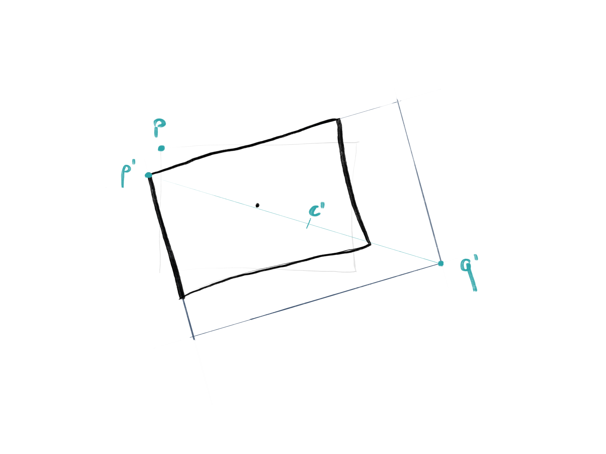

I was recently faced with the following problem: How do you resize a rotated
HTML element by dragging a corner, without the rest of the element moving? This
turns out to be non-trivial, but I finally got to write some JavaScript and
open my Linear Algebra toolbox.

<!--more-->

A bit of background: for the last year [note: 2019], [David Dal
Busco](https://daviddalbusco.com/) and I have been developing
[DeckDeckGo](https://deckdeckgo.com), a tool for creating and sharing
presentations. There was one particular feature we wanted: being able to add
elements to any slide and be able to drag it, resize it and rotate it. This resulted in an [open source Web Component](https://docs.deckdeckgo.com/components/drr/); see also [David's article](https://daviddalbusco.com/blog/introducing-a-new-web-component-to-drag-resize-and-rotate/) on how the component itself works (here we'll focus on the theory).

In normal times, David is taking care of the frontend, and yours truly is
taking care of the backend. But this time, we had to join forces, and I even had to
involve cryptography researcher [Bogdan
Warinschi](https://www.bristol.ac.uk/people/person/Bogdan-Warinschi-65c61a03-5030-4d74-a164-c1b524269868/) (thanks Bogdan).
We had a lot of fire power. Nothing is ever easy in the JavaScript world.

## The Problem

Say you have an HTML element (like a `
`). The browser draws a nice
rectangle. Then you rotate it. The browser draws a nice, rotated, rectangle.
Now you want it to be resized when dragged by a corner. How hard can that be?

We know `top` and `left`, which are the CSS attributes for specifying the
position of the _un-rotated_ rectangle. We call $p$ the top-left corner of the
rectangle. We also know $\theta$, the angle of the rotation. Here we'll focus
on one case: the user drags the bottom-right corner, $p'$. That is, the
bottom-right of the _rotated_ rectangle. We can easily recover its position:
that's where the user's cursor is when they start dragging!

Here's the million dollar question: when the user moves $q'$ around, how do we
make sure that $p'$ (the top-left, rotated corner) stays in place?

Because that, really, is our goal! You might think that for each $n$ pixels that
$q'$ is moved to the right, we increase the rectangle's width by $n$ pixels.
That would work... if there was no rotation! As soon as the rectangle is
rotated, everything gets ugly. One thing in particular that may not be
straightforward is that the unrotated's rectangle top-left corner ($p$) will
move as well...

## Enter: The Matrix

_János Pach Warned You_

Let's recap. All CSS values, `top`, `left`, $\theta$, `width` and `height` are
under our control: we can read and write them. Moreover we know where the
cursor is when the user starts dragging: that's $q'$, the corner being dragged.

One other thing we know: $p'$ should **not** move while $q'$ is being dragged
about. So let's start by figuring out what the position of $p'$ is! The browser
knows it (because it is displaying it) but won't tell us. So we have to
compute it ourselves. How?

The browser starts with a rectangle with top-left corner at ($p_x$, $p_y$) and
then rotates it around the rectangle's center $c$. In order for us to compute
that, we'll use the matrix representation of [Affine
transformations](https://en.wikipedia.org/wiki/Transformation_matrix#Affine_transformations).
The beauty of those matrices is that you can compose them: you want to rotate
$p$ by angle $\theta$, and then translate it by some $v$? Fine! That's
\\( t(v) \\cdot r(\\theta) \\cdot p \\) (because of boring reason we do this right-to-left), where \\( r(\\theta) \\) is the matrix of rotation by $\theta$ (around the origin), and \\( t(v) \\) is the matrix of translation by $v$.

If you're curious, this is what the matrices actually look like:

$t(v) = \begin{bmatrix} 1 & 0 & v_x \\ 0 & 1 & v_y \\ 0 & 0 & 1 \end{bmatrix}, r(\theta) = \begin{bmatrix} \cos(\theta) & - \sin(\theta) & 0 \\ \sin(\theta) & \cos(\theta) & 0 \\ 0 & 0 & 1 \end{bmatrix}$

> But... that's the rotation around the origin! We want to be like the browser, we want to rotate around $c$ !!! I learned matrices in vaaaaaaain!

~~Don't worry, after 5 years studying in Switzerland's Federal Institutes of Technology, I had the exact same feeling. Then JavaScript came to the rescue and I can finally use my knowledge of matrices.~~

Don't worry, remember how we can compose those transformations? In order to
rotate around a point that is not the origin, we just have to pretend that
point is actually the origin for the duration of the rotation. Basically, move
that point (and everything else) to the origin, rotate, and then move back.

That means a rotation around a point $c$ is something like this:

$r(c, \theta) = t(c) \cdot r(\theta) \cdot t(-c)$

and the center of the rectangle is simply `(left + width/2, top + height/2)`.
Congrats, we have $p'$, the-point-that-should-never-move!

$p' = r(c, \theta) \cdot p$

## Rinse, Repeat

Believe it or not, the rest is just a variation on the above. In order to
calculate $p$ (which means `top` and `left`) we can simply rotate $p'$ back,
but this time around the new center of rotation. New? Yes! Because when $q'$
was dragged, the center of the rectangle moved!

This new center is simply the point halfway between the new, dragged $q'$ and
the original, never-to-be-moved top-left corner $p'$. Now the new top-left corner that we should give the browser is:

$\begin{bmatrix} left \\ top \\ 1 \end{bmatrix} = p = r(c', - \theta) \cdot p' = r(\frac{q' + p'}{2}, - \theta) \cdot p'$

What's left to compute? The new width and height. They're kind of tricky to get
in the rotated rectangle, but if we _unrotate_ the resized rectangle, then the
width is the horizontal distance between $p$ and $q$, and the height is the
vertical distance between $p$ and $q$! We just computed $p$, so let's now
figure out $q$ (bottom-right corner in the unrotated, resized rectangle):

$q = r(c', - \theta) \cdot q' = r(\frac{q' + p'}{2}, - \theta) \cdot q'$

$\begin{bmatrix} w \\ h \\ 1 \end{bmatrix} = q - p$

And that's it. We computed the new `top` and `left` values ($p$), which we can
specify when redrawing the resized rectangle, alongside its new width and
new height.

## Where Is The Code?

Deriving the corresponding code is left as an exercise to the reader! Better
yet, why don't you use our [open-source Web Component
instead](https://docs.deckdeckgo.com/components/drr/)? There's a lot we didn't
cover in this article, in particular how to handle minimum widths and heights and how to
make all corners draggable. Instead I invite you to study [DeckDeckGo's code](https://github.com/deckgo/deckdeckgo/tree/267b16dd8ceedcdb92789a3cd98fdc059720fc6f/webcomponents/drag-resize-rotate)!
