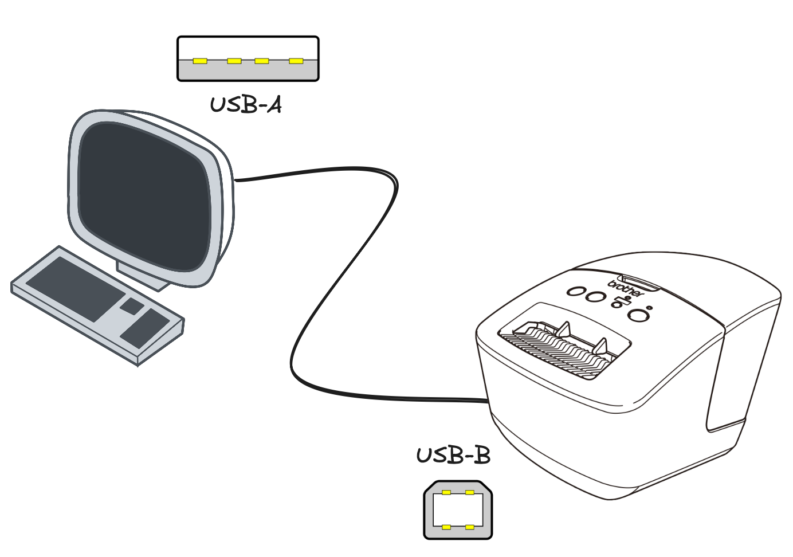
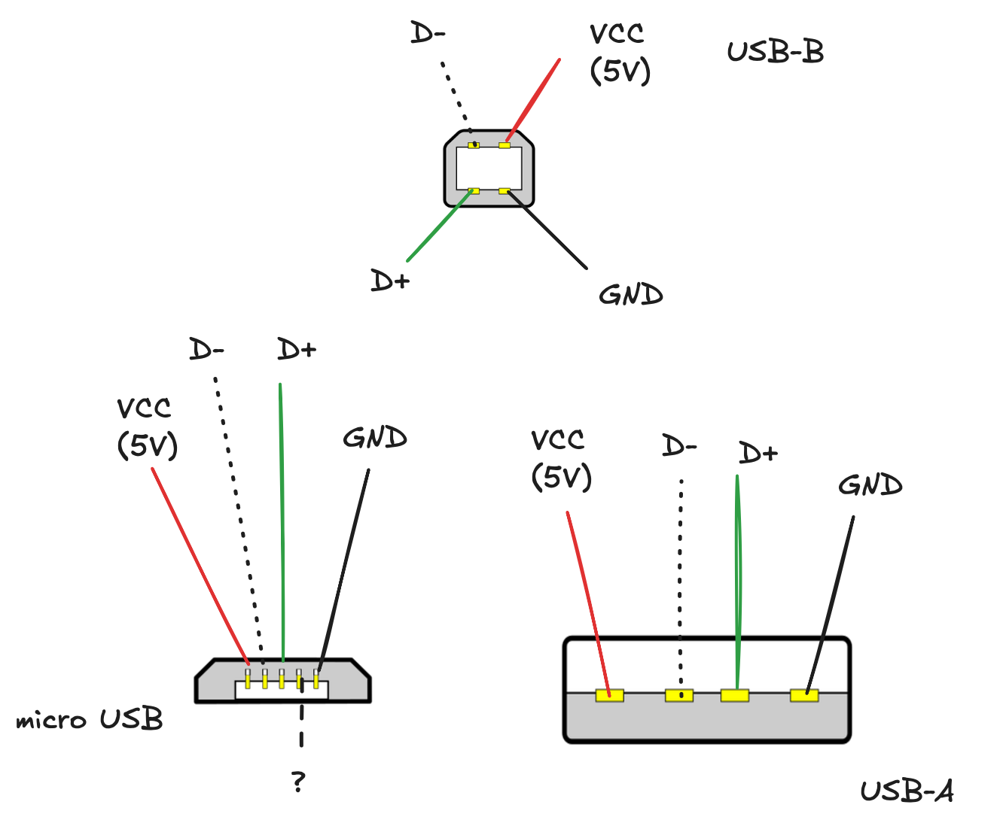
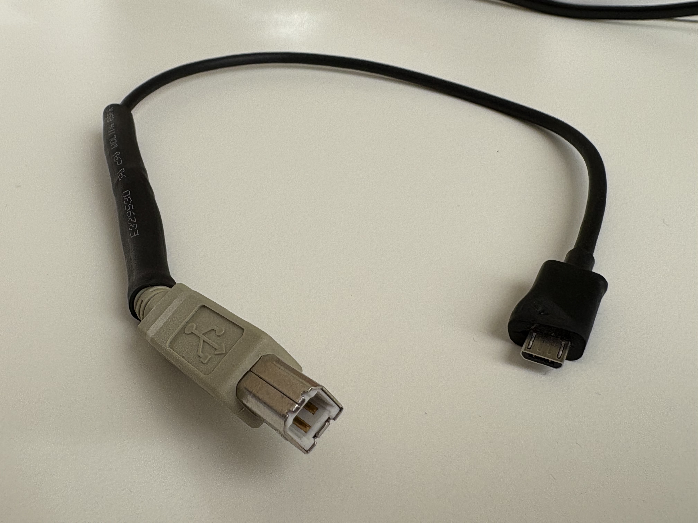

I acquired a second-hand label printer. I did not want to install any proprietary drivers. So I set up a Raspberry Pi Zero with WiFi and installed ImageMagick and Python with Nix to print labels remotely.

<!--more-->


First, I checked if by any chance my label printer — a Brother QL-700 — natively supports wireless connectivity. No luck.

So I then tried sending a job with the printer wired to my laptop. I used a USB-A (normal, "old" USB) to USB-B (printer USB thingy) cable. I'm bringing this up because this will be relevant for the Raspberry Pi Zero setup.



I do not like vendors that force you to install closed-source drivers in order to use your appliances. In general, if I can avoid installing anything, it's even better. As this particular label printer does not speak "standard" printer protocol, I first looked for a WebUSB tool — i.e., a website that uses, for example, Chrome's USB support to talk to USB devices directly. I found [brotherql-webusb](https://github.com/tylercrumpton/brotherql-webusb), which looked promising at first, but after several tries I only managed to print half a picture.

Having spent a good half hour on this already, and having never hacked on WebUSB (or Brother's [raster binary protocol](https://download.brother.com/welcome/docp100278/cv_ql800_eng_raster_101.pdf)) it seemed wise to look for another ready-made solution instead of trying to fix `brotherql-webusb`.

I then came across [brother_ql](https://github.com/pklaus/brother_ql), a Python project that's both a library and a CLI tool for working with Brother label printers. Assuming things work, we should be able to print an image using the following command:

```bash
$ brother_ql -m QL-700 -p usb://0x04f9:0x2042 print ./label.jpg --label 62
```

Here `-m` specifies the model (`QL-700` in my case) and `-p` specifies which USB device to use (as `usb://<vendor ID>:<product ID>`, look at the output of `lsusb` on Linux and `system_profiler SPUSBDataType` on macOS). Then we issue the command (`print`), specify the path to an image (`./label.jpg`) and specify the label type loaded in the machine (`--label 62` for 62mm wide paper rolls).

Of course, things don't usually work out of the box. I tried `pip install`ing the library but the `brother_ql` command kept throwing exceptions. The brother-ql project looks abandoned and the code is not compatible with newer versions of its dependencies.

Finding the right set of versions that work together can take a long, long time, so I check if the version from nixpkgs worked — pinned at a specific recent commit for future reference:

```bash
nix run nixpkgs/97eb7ee0da337d385ab015a23e15022c865be75c#python311Packages.brother-ql -- -m QL-700 -p usb://0x04f9:0x2042 print ./label.jpg --label 62
```

Lo and behold, it worked! The printer spit out a label.

> [!NOTE]
>
> BlueSky user Peter Rice [pointed out](https://bsky.app/profile/pvsr.dev/post/3lxjawqge3c2p) that the `brother_ql` package in nixpkgs is [actually a fork](https://github.com/NixOS/nixpkgs/blob/97eb7ee0da337d385ab015a23e15022c865be75c/pkgs/development/python-modules/brother-ql/default.nix#L21) of `brother_ql` — which includes some fixes!

The next step was to set up the RPi Zero. I flashed the default Raspberry Pi OS (selecting RPi Zero 2W in the device list in Raspberry Pi Installer). I also specified the hostname to be `brother` and added my SSH pubkey & my WiFi credentials

Once the card was flashed, I could boot the RPi Zero. I wasn't sure if Nix was supported and if nixpkgs had good support for arm64-linux. I tried:

```bash
ssh pi@<device>.local
curl -fsSL https://install.determinate.systems/nix | sh -s -- install
```

After a bit, things seemed to work. So I `scp`ed an image to the pi and ran the exact same command that had worked on my laptop:

```bash
nix run nixpkgs/97eb7ee0da337d385ab015a23e15022c865be75c#python311Packages.brother-ql -- -m QL-700 -p usb://0x04f9:0x2042 print ./label.jpg --label 62
```

This took ages (the Pi zero is not very powerful, plus some derivations were not cached and had to be built) and eventually I was greeted with the following error:

```
ValueError: Device not found
```

This was a very good sign. This is the same error I would get on my laptop if I forgot to plug in the device. At this point this means that Nix works, and I'm able to use the same nixpkgs commit that contains a working `brother-ql`.

The next step was to find the right cable.

The Raspberry Pi Zero has no USB-A ports but has 2 microUSB ports. One of them is for power (only?). The second port can be used as "host" USB port. This is unconventional because microUSB is mostly used on _devices_ (AFAIU), i.e. not on _hosts_ like laptops.

You'd see microUSB on a phone that is meant to be connected as a "device" (or _slave_) to a "host" device like a computer. If you've ever heard of "OTG" or "On-The-Go cables", that's what this refers to: a way for microUSB devices to work as USB hosts.



_for illustrative purposes only_

In order to be used as both "host" and "device", microUSB connectors have an extra pin called "ID". Depending on what the ID pin is wired to, the connector (well, the device it's soldered to) can advertise itself either as USB "host" or "device". In our case, we don't have to worry about this. The Raspberry Pi Zero is already (hard?) wired as microUSB "host" (for the curious: by shorting this extra "ID" pin to ground).

On the other hand, USB-B is functionally like USB-A but with a different shape. I ended up cutting one microUSB-to-something cable, one USB-A-to-USB-B cable and spliced the microUSB and USB-B sides together: red to red, black to black, green to green and white to white. With this Franken-cable you can connect Raspberry Pi Zero to any printer.



With this new cable I re-ran the test `brother_ql` command and... it worked! To clean up a bit, I installed `brother_ql` globally and used image magick to generate labels dynamically:

```bash
# install both imagemagick and brother-ql
$ nix profile add nixpkgs/97eb7ee0da337d385ab015a23e15022c865be75c#{imagemagick,python311Packages.brother-ql}
$ brother_ql --help

Usage: brother_ql [OPTIONS] COMMAND [ARGS]...

  Command line interface for the brother_ql Python package.
  ...
$ magick \
        -background none -fill black -pointsize 300 \
        label:"hello world" \
        -rotate 90 -resize "306x991>" -gravity center -background white \
        -extent 306x991 -units PixelsPerInch -density 300 png:- \
        | brother_ql -m QL-700 -p usb://0x04f9:0x2042 print - --label 29x90
< Job is sent to printer >
```

The last command above creates an image from text using `magick` from ImageMagick and pipes the resulting image (as a png) to stdout. This is fed into `brother_ql`.

<iframe width="560" height="315" src="https://www.youtube.com/embed/42Vdf88h7vc?si=v2Qr1PqVM-84AZKc" title="YouTube video player" frameborder="0" allow="accelerometer; autoplay; clipboard-write; encrypted-media; gyroscope; picture-in-picture; web-share" referrerpolicy="strict-origin-when-cross-origin" allowfullscreen></iframe>

I considered hosting a little [Excalidraw](https://excalidraw.com/) page on the Pi Zero and hooking into it to allow saving images printing them to the printer. It would also be nice to have a 3D printed enclosure for the Raspberry Pi and to have a single cable powering both the printer and the Pi. There might be a 5V source inside the printer already.

But at this point I had already sunk a couple hours into this and still didn't have a use-case for a label printer so I stopped.
