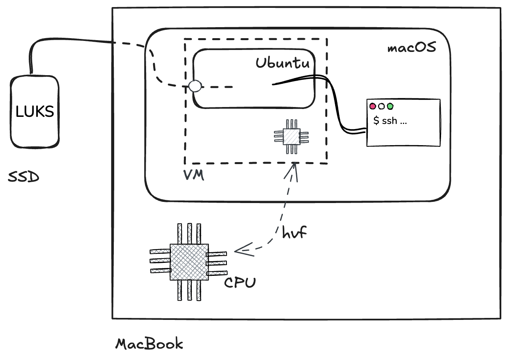
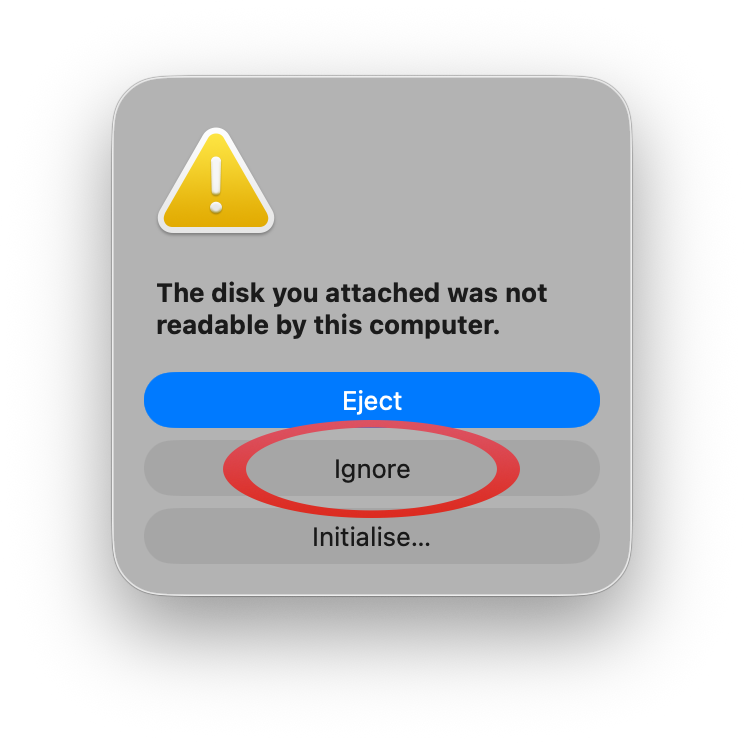

Recently I needed to access my `LUKS`-encrypted, `ext4` drives from a MacBook. This can come in handy in a few situations — future-proofing backups, needing to access Linux drives in a pinch while the NAS is down, etc — so here's a quick playbook for my future self and others in the same position!

<!--more-->

## Overview

Unfortunately `ext4` and `LUKS` are not supported natively by macOS so accessing the data from a Mac requires extra tooling. I've aimed for a lightweight and minimal, mostly stateless solution; this in turn should make it reliable and future-proof (I'll report back in ten years from now). To minimize the risk of bit-rot, the only dependency beyond stock macOS is (the amazing) `QEMU`.

In the [next section](#architecture) I'll outline the solution, then walk through the actual [playbook](#playbook) I use when accessing those pesky Linux drives from a Mac. In the [final section](#wrapping-up) we'll wrap up by looking at some issues with the playbook and possible improvements. Let's go!

## Architecture

The solution works by spinning up a virtual machine (VM) running a minimal Ubuntu image. The VM is created using [`QEMU`](https://www.qemu.org/), the lightweight CLI tool that also powers Docker Desktop and Podman Desktop on macOS. Because the external drive is passed raw to the VM and because `QEMU` supports Apple's Hypervisor Framework for hardware acceleration, the VM runs smoothly and the drive's data can be accessed efficiently.

The Ubuntu system is set up using `cloud-init`, which is a collection of tools and interfaces more often used by cloud services like AWS to set up new machines and instances automatically, which makes this setup — and in particular the SSH config — automated and reproducible. SSH is used both for accessing the Ubuntu system (to e.g. decrypt the `LUKS` partition) and to transfer the files between the VM and macOS.



To recap, the external drive is connected to the MacBook but the content is not directly accessed from macOS; instead the drive is passed through to an Ubuntu VM created with `QEMU`. The Ubuntu system is configured with `cloud-init` to allow SSH access from the macOS host, for terminal access (for `LUKS` and mount operations) and then also for transferring files. Note that macOS never mounts or interprets the encrypted filesystem; all `LUKS` and `ext4` handling happens inside the VM.

Let's now see how the VM is set up and how the files can be transferred!

## Playbook

We need to prepare a few images required by the VM to boot. We'll be downloading and creating a few files, so it's best to move to an empty directory:

```shell
cd $(mktemp -d)
```

Download the official Ubuntu image:

```shell
curl -LO https://cloud-images.ubuntu.com/noble/current/noble-server-cloudimg-arm64.img
```

> [!NOTE]
>
> You can also pin an old (specific) image by date. In my experience however using the latest (`current`) image is the most reliable: the tools we use from Ubuntu (SSH, `LUKS`) don't (or very rarely) change interface, but old Ubuntu images are not stored indefinitely by Canonical.

Create the `cloud-init` data:

```shell
mkdir -p ./cloud-init
cat << EOF > ./cloud-init/user-data
#cloud-config
chpasswd:
  expire: False
ssh_pwauth: False
ssh_authorized_keys:
$(cat ~/.ssh/*.pub | sed 's/^/  - /')
EOF

cat << EOF > ./cloud-init/meta-data
instance-id: my-network/my-vm
EOF
```

All `cloud-init` configuration is done with `YAML`. The first file, `./cloud-init/user-data`, sets up a single user and disables password authentication, only allowing SSH access. The public key(s) are read from the host (i.e. Macbook Air). The value in `./cloud-init/meta-data` is required for `cloud-init` to run successfully though the specific content does not matter much (see the [`cloudinit` reference](https://cloudinit.readthedocs.io/en/latest/reference/examples.html) for more information).

For Ubuntu to correctly recognize the `cloud-init` data, it needs to be mounted as a CD-ROM with volume name `cidata`.

Create an ISO image with volume name `cidata` with content from `./cloud-init`, using the macOS tool `hdiutil`:

```shell
hdiutil makehybrid -iso -joliet -default-volume-name cidata -o ./seed.iso ./cloud-init
```

Now we need `QEMU`. I use Nix to install `QEMU` from nixpkgs, as it allows an ephemeral install without polluting the system.

Install `QEMU` from `nixpkgs`:

```shell
nix build nixpkgs#qemu
PATH="$PWD/result/bin:$PATH"
QEMU="$PWD/result/share/qemu"
qemu-system-aarch64 --version
```

> [!NOTE]
>
> `QEMU` can also be installed with `brew`, see https://www.qemu.org/download/#macos.

Ubuntu needs some firmware to boot under UEFI on Apple Silicon. Said firmware should be shipped as part of the `QEMU` install.

Locate the aarch64 firmware in the `QEMU` install:

```shell
ls "$QEMU/edk2-aarch64-code.fd" # this file should exist
```

The boot process also requires an additional, blank 64MB drive. Use the `qemu-img` tool from `QEMU` to create a sparse empty image:

```shell
qemu-img create -f qcow2 varstore.img 64M
```

At this point we have the OS image ready, the `cloud-init` "CD-ROM" image, as well as two boot-related images. All these will be connected to the VM; now let's actually set up the physical (external drive).

Connect the external drive to the MacBook and when prompted tell macOS to ignore it:



> [!WARNING]
>
> From here on, do not _plug_ or _unplug_ **any** disks. Whenever a new disk is plugged in, macOS rescans all the disks and might attempt to mount `/dev/disk4` again which will wreak havoc in the VM.

We need to identify the disk number macOS assigned to the external drive.

Use `diskutil list` and look for a drive labeled as `external, physical`, which has a partition of type `Linux` and a `SIZE` that matches the drive's:

```shell
$ diskutil list
/dev/disk0 (internal, physical):
   #:                       TYPE NAME                    SIZE       IDENTIFIER
   0:      GUID_partition_scheme                        *251.0 GB   disk0
   ...

/dev/disk3 (synthesized):
   #:                       TYPE NAME                    SIZE       IDENTIFIER
   0:      APFS Container Scheme -                      +245.1 GB   disk3
                                 Physical Store disk0s2
   1:                APFS Volume Macintosh HD            12.2 GB    disk3s1
   ...

/dev/disk4 (external, physical): # [sh! highlight]
   #:                       TYPE NAME                    SIZE       IDENTIFIER [sh_!highlight]
   0:     FDisk_partition_scheme                        *2.0 TB     disk4 #[sh!highlight]
   1:                      Linux                         2.0 TB     disk4s1 #[sh!highlight]

...
```

> [!WARNING]
>
> In the next two commands replace `disk4` with your disk. Passing in the wrong disk might incur unexpected data loss, I'm not responsible for you erasing your data in any way, etc, etc. Enjoy responsibly.

Unmount the drive:

```shell
diskutil unmountDisk /dev/disk4
```

### Starting the VM

Start the Ubuntu VM with the external drive:

> [!NOTE]
>
> Note the use of `/dev/rdisk4` (instead of `/dev/disk4`) so that the disk is passed through "raw". This gives Ubuntu direct control over the disk, without `QEMU` or macOS interfering.

```shell
sudo qemu-system-aarch64 \
  -cpu host -M virt,accel=hvf -m 2G \
  -drive file="$QEMU/edk2-aarch64-code.fd",if=pflash,format=raw,readonly=on \
  -drive file=varstore.img,if=pflash \
  -drive file=./noble-server-cloudimg-arm64.img,format=qcow2,if=virtio \
  -drive file=seed.iso,index=1,media=cdrom \
  -drive file=/dev/rdisk4,if=virtio,format=raw,cache=none \
  -nographic -nic user,hostfwd=tcp:127.0.0.1:2222-:22
```

This creates a VM with 2 GB of RAM (`-m 2G`) and specifies the CPU as `host` using Apple's Hypervisor Framework (`hvf`) to avoid software CPU emulation.

Five `-drive`s are attached to the machine:

- The first two are necessary for Ubuntu to boot correctly. Those are attached as flash (`if=pflash`) and use the `aarch64` firmware from the `QEMU` install as well as the `varstore` image we created earlier.
- The third drive is the Ubuntu image. This is effectively the (writable) OS filesystem that will be booted from. Once booted, Ubuntu will see this drive much like it would an internal SSD.
- The fourth drive is the image we baked from `./cloud-init` and its YAML. Ubuntu will see it as a CD-ROM and recognize it as cloud-init data and use it to set up the default user `ubuntu`.
- The fifth and final drive is the external, `LUKS`-encrypted drive, passed through. Ubuntu will see this as an external drive.

We do also map the VM's SSH port (`22`) to a free port on the macOS host (here `2222`) so that we can connect to the VM via SSH.

After a few seconds the VM is up and running and accessible via SSH. For more information on `QEMU`'s CLI options refer to [the official documentation](https://www.qemu.org/docs/master/system/qemu-manpage.html#hxtool-1).

### Decrypting and accessing the drive

SSH into the VM:

```shell
# from macOS
SSH_CMD='ssh -o StrictHostKeyChecking=no -o UserKnownHostsFile=/dev/null -p 2222'
eval "$SSH_CMD ubuntu@localhost"
```

It's handy to keep the SSH command in a variable so it can be reused with other commands like `rsync`. Host key checking is disabled because I spin up a new VM every time.

Now identify the relevant partition inside the VM:

```shell
ubuntu@ubuntu:~$ sudo lsblk
NAME    MAJ:MIN RM  SIZE RO TYPE MOUNTPOINTS
vda     253:0    0  3.5G  0 disk
├─vda1  253:1    0  2.5G  0 part /
├─vda15 253:15   0   99M  0 part /boot/efi
└─vda16 259:0    0  923M  0 part /boot
vdb     253:16   0  900K  1 disk
vdc     253:32   0  1.8T  0 disk
└─vdc1  253:33   0  1.8T  0 part # [sh! highlight]
```

Decrypt and mount the partition:

```shell
# from Linux VM via SSH
sudo cryptsetup luksOpen /dev/vdc1 ext-drive # will ask for device passphrase
sudo mkdir -p /mnt/ext-drive
sudo mount /dev/mapper/ext-drive /mnt/ext-drive
```

The decrypted drive content is accessible!

Transfer content between the VM and macOS using `rsync`:

```shell
# from macOS
rsync --archive --verbose --human-readable --progress \
    --rsh "$SSH_CMD" \
    ./my-new-backup/ ubuntu@localhost:/mnt/ext-drive/my-backup-v42
```

The first argument turns on archive mode so that files are copied recursively. We also enable verbose, human readable output, as well as progress reporting. The `--rsh` argument specifies a custom SSH command to use; if you followed along then `$SSH_CMD` should contain the ssh command with port. The last two arguments specify what to copy where; in general `rsync src/ dest` will copy every file from `src/` into `dest`, such that `src/foo` becomes `dest/foo` (same as `cp`)

Once we're done copying or playing with the files, we can `umount` the drive, close it from a `LUKS` point of view, and power off the VM:

```shell
# from Linux VM via SSH
sudo umount /mnt/ext-drive
sudo cryptsetup close ext-drive
sudo poweroff
```

Finally, we can turn off the drive from `macOS`:

```shell
# from macOS
diskutil eject /dev/disk4
```

## Wrapping up

That's it for the playbook!

While this works pretty well in practice, there are a few things that could be improved. For instance, it would be nice to have somewhat more native integration with `Finder` — this could be done with `sshfs` (somewhat deprecated as I understand) or by setting up Samba from within Ubuntu and connecting to it from `Finder`.

There's also the issue that, as it is now, it's a bunch of commands you have to get right; get one wrong and you might wipe your system or backups. I like running them manually so that I can double check everything before hitting enter, but over time I might start porting them to a small script, or even better a full-blown app (I've been looking for an excuse to try [Tauri](https://tauri.app/) for a while).

For now, I'll stick to the playbook. Feel free to use it and tweak it — at your own risk of course!
